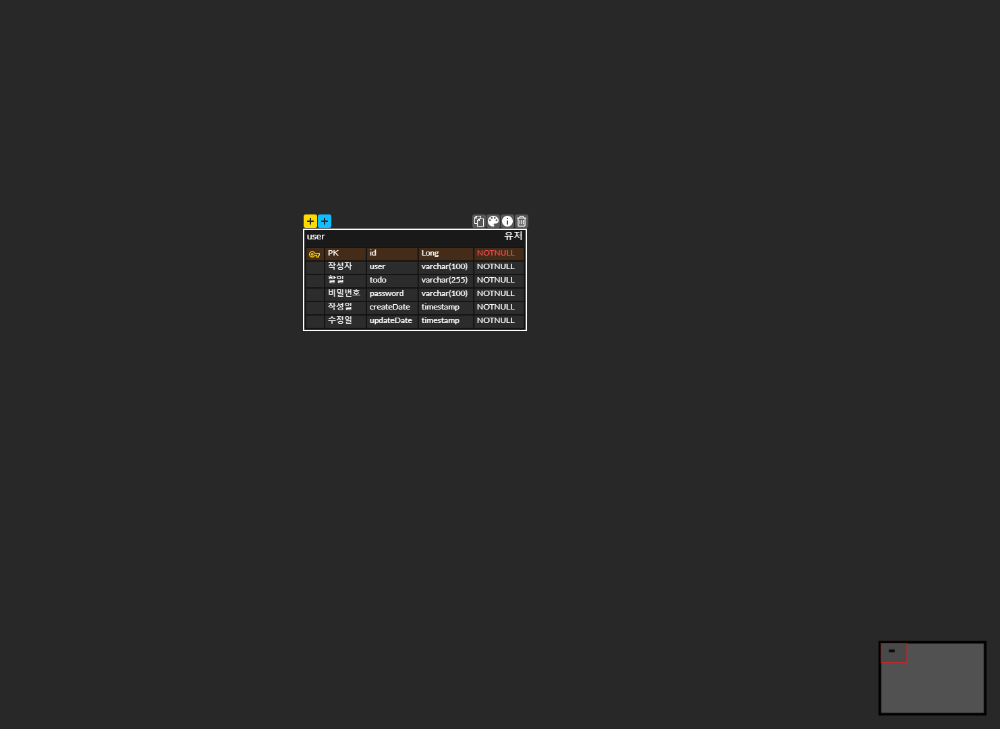

# 일정 관리 앱

## API 목록

| Method | URL             | RequestParam         | Response                                                                                            | Request                                                                                                          | Description | StatusCode  | 
|--------|-----------------|----------------------|-----------------------------------------------------------------------------------------------------|------------------------------------------------------------------------------------------------------------------|------------|-------------|
| POST   | /schedules      | -                    | { "todo":"놀기" "user":"최다원" "createDate: YYYY-MM-DD "updateDate: YYYY-MM-DD }    | { "todo":"놀기" "user":"최다원" "password":"1234" }                                                   | 일정 생성      | 일정 등록: 200  | 
| GET    | /schedules      | -                    | { "todo":"놀기" "user":"최다원" "createDate: YYYY-MM-DD "updateDate: YYYY-MM-DD }    | http://localhost:8080/api/schedules                                                                              |    일정 조회     | 일정 조회: 200ㅂ |  |
| GET    | /schedules/{id} | updateDate, username | { "todo":"놀기" "user":"최다원" "createDate: YYYY-MM-DD "updateDate: YYYY-MM-DD }... | http://localhost:8080/api/schedules/2                                                                            |                                         단건 일정 조회                       | 일정 조회: 200  ||
| PUT    | /schedules/{id} | -                    |     { "todo":"놀기2" "user":"최다원2" "createDate: YYYY-MM-DD "updateDate: YYYY-MM-DD }                                                                                                | http://localhost:8080/api/schedules/2       { "todo":"놀기2" "user":"최다원2" "password":"1234" } | 일정 수정      | 일정 수정: 200  |
| DELETE | /schedules/{id} | -                    |                                                                                                     | http://localhost:8080/api/schedules/2 { "password":"1234" }                                          | 일정 삭제      | 일정 삭제: 200  |

## ERD

## SQL
>>create table calendar ( 
>id int auto_increment primary key, 
>todo varchar(255) not null, 
user varchar(100) not null, 
password varchar(100) not null, 
createDate timestamp default current_timestamp, 
updateDate timestamp default current_timestamp on update current_timestamp 
>>);

# 📱 일정관리 앱을 만들어보자!
Spring을 처음 배우고 낮설어하는 개발자를 위해, 직접 개발하면서 Spring에 한 발자국을 다가갈 수 있는 과제입니다. 이 과제를 통해서 3-Layer Architecture에 대해서 익숙해질 수 있고 무엇보다 가장 중요한 CURD에 대해서 쉽게 이해할 수 있습니다!

# ⚠️ 클래스 설명
1. Controller 
- 클라이언트에게 요청을 받고 응답하는 역할을 함
2. Service
- 비즈니스 로직을 수행함
- 요청을 해석해서 레포지토리 계층에게 전달함
3. Repository
- 데이터베이스와 연동하여 실제 데이터를 관리함
- CRUD를 수행
4. Entity
- 테이블과 매핑이 되는 클래스
5. RequestDto
- 클라이언트가 서버에게 요청하는 것
6. ResponseDto
- 서버가 클라이언트에게 응답하는 것

# 🖥️ 개발환경
- JAVA 8
- JDK 21.0.5
- Spring Boot
- InteliJ IDEA
- JDBC
- My SQL

# 🕰️ 개발기간
2025-01-23 ~ 2025-02-04

# 📌 주요기능

## Lv 1. 일정 생성 및 조회
1. 일정 생성(일정 작성하기)
- 일정 생성시, 포함되어야할 데이터: 할일, 작성자명, 비밀번호, 작성일/수정일
- 작성일과 수정일은 날짜와 시간이 모두 포함한 상태여야합니다.
- 각 일정의 고유 식별자(id)가 자동으로 생성하여 관리해야합니다.
- 최초 입력시에는 수정일은 작성일과 동일해야함.

2. 전체 일정 조회(등록된 일정 불러오기)
- 다음 조건을 바탕으로 등록된 일정 목록을 전부 조회해야합니다. (수정일, 작성자명)
- 수정일 기준으로 내림차순으로 정렬하여 조회합니다.

## Lv 2. 일정 수정 및 삭제
1. 선택한 일정 조회(선택한 일정 정보 불러오기)
- 선택한 일정 단건의 정보를 조회할 수 있습니다.
- 일정의 고유 식별자(id)를 사용하여 조회합니다.

2. 선택한 일정 삭제
- 선택한 일정을 삭제할 수 있습니다.
- 서버에 일정 수정을 요청할 때 비밀번호를 함께 전달합니다.

## Lv 3. 예외 발생 처리
1. 수정, 삭제 시 요청할 때 보내는 비밀번호가 일치하지 않을 때 예외가 발생합니다.
