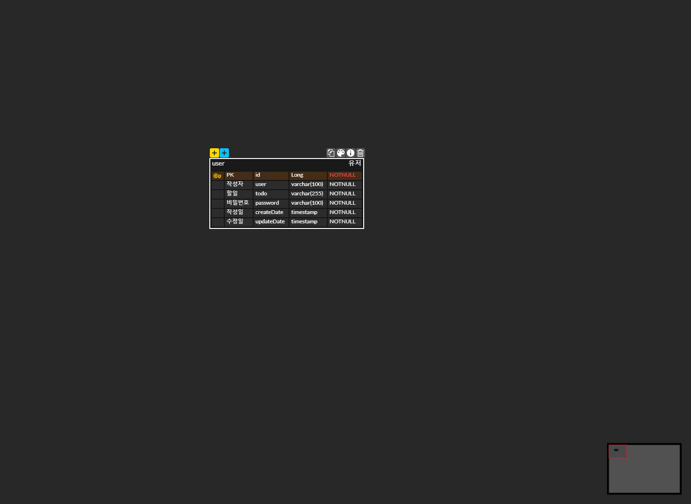

# 일정 관리 앱

## API 목록

| Method | URL             | RequestParam         | Response                                                                                            | Request                                                                                                          | Description | StatusCode | 
|--------|-----------------|----------------------|-----------------------------------------------------------------------------------------------------|------------------------------------------------------------------------------------------------------------------|------------|------------|
| POST   | /schedules      | -                    | { "todo":"놀기" "user":"최다원" "createDate: YYYY-MM-DD "updateDate: YYYY-MM-DD }    | { "todo":"놀기" "user":"최다원" "password":"1234" }                                                   | 일정 생성      | 일정 등록: 200 | 
| GET    | /schedules      | -                    | { "todo":"놀기" "user":"최다원" "createDate: YYYY-MM-DD "updateDate: YYYY-MM-DD }    | http://localhost:8080/api/schedules                                                                              |         | 일정 조회      | 일정 조회: 200 |
| GET    | /schedules/{id} | updateDate, username | { "todo":"놀기" "user":"최다원" "createDate: YYYY-MM-DD "updateDate: YYYY-MM-DD }... | http://localhost:8080/api/schedules/2                                                                            |                                                                | 단건 일정 조회   |일정 조회: 200|
| PUT    | /schedules/{id} | -                    |     { "todo":"놀기2" "user":"최다원2" "createDate: YYYY-MM-DD "updateDate: YYYY-MM-DD }                                                                                                | http://localhost:8080/api/schedules/2       { "todo":"놀기2" "user":"최다원2" "password":"1234" } | 일정 수정      |   일정 수정: 200         |
| DELETE | /schedules/{id} | -                    |                                                                                                     | http://localhost:8080/api/schedules/2 { "password":"1234" }                                          | 일정 삭제      |     일정 삭제: 200       |

## ERD
